<div align="center">

<!-- V4 ULTIMATE VIP HEADER -->


<!-- PRIMARY BRAND BANNER -->


<br><br>

<!-- DYNAMIC TYPING SVG -->
<a href="https://git.io/typing-svg">
  
</a>

<br>

<!-- ANIMATED DIVIDER -->


<br>

<!-- USER PROVIDED GIF 1 (OVERVIEW SECTION) -->


<br><br>

<!-- SYSTEM STATUS BADGES -->
<p>
  
  
</p>

<!-- VISITOR MONITOR -->
<p>
  
</p>

</div>

---

## 🔱 RDX-BOT v0.7 ELITE CAPABILITIES

**RDX-BOT 0.7** is the pinnacle of Facebook Messenger automation. Engineered for dominance, stability, and intelligence.

<div align="center">

<!-- USER PROVIDED IMAGE (FEATURE HIGHLIGHT) -->


</div>

<br>

### 🛡️ ELITE SYSTEM ARCHITECTURE

```mermaid
graph TD
    A[🔱 RDX ULTIMATE 0.7] --> B(🤖 RDXAI Helper)
    A --> C(💰 Global Bank)
    A --> D(🔒 Security Lock)
    A --> E(🚀 RDX-HERE Admin)
    
    style A fill:#FF0000,stroke:#fff,stroke-width:4px,color:#fff
    style B fill:#000,stroke:#FF0000,color:#fff
    style C fill:#000,stroke:#FF0000,color:#fff
    style D fill:#000,stroke:#FF0000,color:#fff
    style E fill:#000,stroke:#FF0000,color:#fff
```


---

## 💎 EXCLUSIVE VIP DASHBOARD

<div align="center">

<!-- USER PROVIDED GIF 2 (FEATURES SECTION) -->


<br><br>

| 🚀 **FEATURE** | ⚡ **VIP ELITE DESCRIPTION** | 🔋 **STATUS** |
|:---:|:---|:---:|
| **RDXAI HELPER** | Advanced AI bot guide with Hinglish conversion | `ELITE` |
| **CONVO SYSTEM** | Multi-stepper interactive lockdown protocol | `SECURE` |
| **GLOBAL ECONOMY** | VIP Banking, Credit Cards, and Ranking Rewards | `STABLE` |
| **RDX-HERE** | Administrative flood and user addition suite | `ON-DECK` |

</div>

---

## 🚀 DEPLOYMENT CENTER

### 🛠️ Step 1: Secure AppState
Get the **C3C AppState Extension** to safely export your Facebook session.

<p align="center">
  <a href="https://www.mediafire.com/file/tbuqw6nzlkd2jz5/c3c-fbstate-1.4_%25286%2529.zip/file">
    
  </a>
</p>

### 🛠️ Step 2: GitHub Runtime
Paste this into `.github/workflows/npn-publish.yml` for 24/7 execution.

```yaml
name: Run Bot - RDX-BOT

on:
  push:
    branches:
      - main

jobs:
  run-bot:
    runs-on: ubuntu-latest

    steps:
      - name: Checkout code
        uses: actions/checkout@v3

      - name: Setup Node.js
        uses: actions/setup-node@v3
        with:
          node-version: '20'

      - name: Install dependencies
        run: npm install

      - name: Run the bot
        run: node index.js
```

---

## 👑 THE MASTERMIND BEHIND RDX �

<div align="center">

<!-- USER PROVIDED GIF 3 (CREATOR SECTION) -->


<br>

<!-- CAPSULE RENDER CREATOR - RAINBOW ANIMATED -->


<br>

<p align="center">
  <a href="https://www.facebook.com/profile.php?id=100009012838085">
    
  </a>
  &nbsp;&nbsp;&nbsp;
  <a href="https://wa.me/qr/Q65AI7L4ZOBFO1">
    
  </a>
  &nbsp;&nbsp;&nbsp;
  <a href="https://youtube.com/@rdx-bot-zone?si=07glyrc8s-lSIkK8">
    
  </a>
</p>

<!-- SIGNATURE TYPING -->


<br>

<!-- RAINBOW ANIMATED LINE -->


<p align="center">
  🚀 <b>RDX-BOT v0.7</b> | Developed by <b>SARDAR RDX</b> | © 2026
</p>

<!-- ULTIMATE FOOTER WAVE -->


</div>
